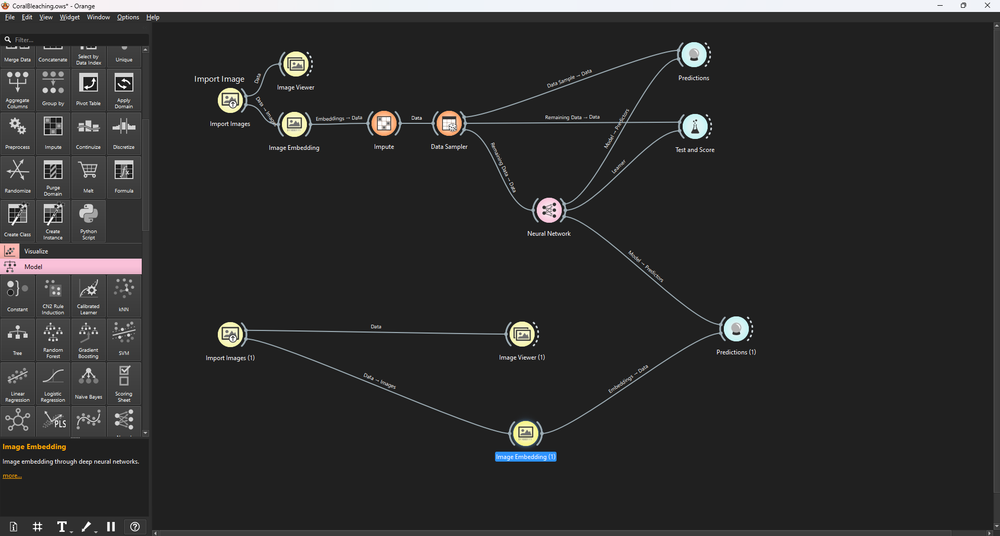

# 🚀 Project Resources  

Welcome! Below are some useful resources and backup installation links in case you face issues while setting things up.  

---

## 📦 Module Installation Links (Backup)  

If the installation fails, you can manually install from these repositories:  

- 🔗 [Orange3 Image Analytics](https://github.com/biolab/orange3-imageanalytics)  
- 🔗 [Orange3 Text](https://github.com/biolab/orange3-text)  

---

## 🌐 File Transfer Server  

Easily share and transfer files using the Streamlit-powered server:  

👉 [File Sharer App](https://file-sharer.streamlit.app/)  

---

## 📖 Notes  

- Always ensure dependencies are up to date.  
- Use these links only if the standard installation process fails.  

---

## 🪸 Coral Bleaching Workflow  

Here’s the workflow representation:  

  

---

✨ _Made with care to make your setup easier!_
